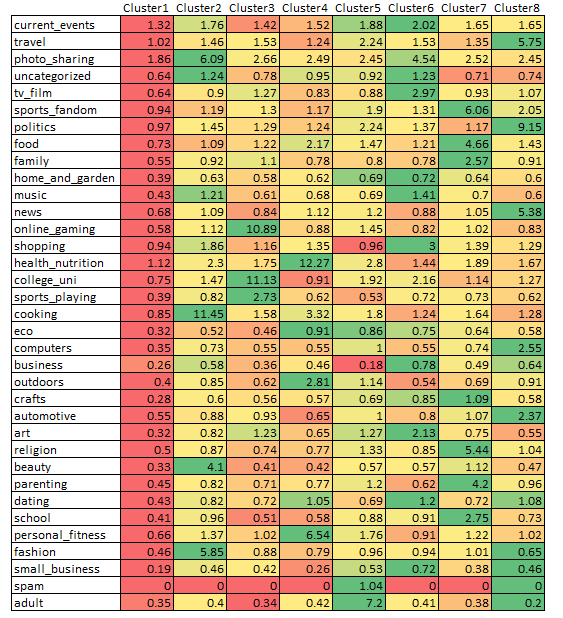

### Probability Practice

#### Part A.
Here's a question a friend of mine was asked when he interviewed at Google.

Visitors to your website are asked to answer a single survey question before they get access to the content on the page. Among all of the users, there are two categories: Random Clicker (RC), and Truthful Clicker (TC). There are two possible answers to the survey: yes and no. Random clickers would click either one with equal probability. You are also giving the information that the expected fraction of random clickers is 0.3.

After a trial period, you get the following survey results: 65% said Yes and 35% said No.

What fraction of people who are truthful clickers answered yes?  

#### Answer:  

Let us list down all the listed porbabilities to get started with the formulation of the problem

* Total probability of an yes $P(Y) = 0.65$
* Probability of an yes given the click is by a random clicker $P(Y/RC) = 0.5$
* Probability of a clicker being a random clicker $P(RC) = 0.3$
* Probability of a clicker being a truthful clicker $P(TC) = 0.7$

Let's consider the total probability equation of yes to get started with:
Total probability $P(Y)$ =  
Joint probability of Yes and Random Clickers $P(Y,RC)$                                      +Joint probability of Yes and Random Clickers $P(Y,TC)$   
i.e $P(Y) = P(Y,RC) + P(Y,TC)$  
=>  $P(Y) = P(Y/RC)*P(RC) + P(Y/TC)*P(TC)$  
=>  $P(Y/TC)*P(TC) = P(Y) - P(Y/RC)*P(RC)$  
=>  $P(Y/TC) = (P(Y) - P(Y/RC)*P(RC))/P(TC)$  
Substituting the given values    
$P(Y/TC) = (0.65 - (0.5*0.3))/0.7

**Fraction of people who are truthful clickers answered yes = $5/7$**  

#### Part B.

Imagine a medical test for a disease with the following two attributes:

The sensitivity is about 0.993. That is, if someone has the disease, there is a probability of 0.993 that they will test positive.
The specificity is about 0.9999. This means that if someone doesn't have the disease, there is probability of 0.9999 that they will test negative.
In the general population, incidence of the disease is reasonably rare: about 0.0025% of all people have it (or 0.000025 as a decimal probability).

Suppose someone tests positive. What is the probability that they have the disease? In light of this calculation, do you envision any problems in implementing a universal testing policy for the disease?

#### Answer:
Let's assume a population of 1 billion to continue with the problem

* Probability of positive test result given the presence of disease $P(P/D) = 0.993$
* Probability of negative result given there is no disease          $P(N/No Dis) = 0.9999$
* Total probability of having a disease                             $P(D) = 0.000025$

The following confusion matrix is used for calculating the TP,TN,FP and FN

Confusion matrix| Actual      
------------    | ----------- | ------------- |---------------
Test Result     | Disease     | No Disease
                | Postive     | 24,825         | 99,997
                | Negative    | 175           | 999,875,003

* Using the above calculations, we can see that there is a 0.1988 probability of having a disease if the test result is positive
* From this, we can infer that only ~20 out of 100 people who are tested positive have the disease and started treatment with just one test result will lead to unnecessary drain of resources and side effects.

**Suppose, if this is the only test available for screening,there can be an interesting procedure that can be followed to reduce the false positives**  
* Consider the people who were tested positive for the first time and perform the test again given that the specificty and the sensitivity of the test remains constant  
* One notable change is that the total probability of having a disease will change in this scenario  

* Probability of positive test result given the presence of disease $P(P/D) = 0.993$
* Probability of negative result given there is no disease          $P(N/No Dis) = 0.9999$
* Total probability of having a disease                             $P(D) = 0.1988$

Following is the confusion matrix for the second test

Confusion matrix| Actual      
------------    | ----------- | ------------- |---------------
Test Result     | Disease     | No Disease
                | Postive     | 24,653.90     | 10.00
                | Negative    | 173.79        | 99,987.31
**If the test result is positive even in the second test, then we can sure that there is a 0.999 probability that the person is having a disease.Although, this is feasible only if the test is affordable**  

* Decimals are being considered for mathematical convenience  

### Exploratory analysis: green buildings  

### The Case  

The EDA has been carried out in multiple phases to arrive at a final conclusion about building a Green building or Non-green buildings  
Step 1: Perform exploratory data analysis on **all buildings** in the dataset to find any insights at a macro level  
Step 2: Perform EDA by **splitting the buildings in to Green and Non-Green**  
Step 3: Perform EDA by considering **local markets(clusters)** and derive insights  

Importing the data and all the required libraries  
```{r, echo = FALSE, message=FALSE, warning=FALSE }
library(plyr)
# library(dplyr)
library(ggplot2)
library(gridExtra)
green.df.raw = read.csv('greenbuildings.csv',na.strings = '')
```
#### Step 1: Analysis on all buildings  
1.Obtain a brief idea about the columns in the dataset  
```{r, echo = FALSE, message=FALSE, warning=FALSE }
str(green.df.raw)

green_buildings = subset(green.df.raw,green.df.raw$green_rating == 1)
non_green_buildings = subset(green.df.raw,green.df.raw$green_rating!= 1)

# Median rent in green buildings and non-green buildings
print(paste("Median rent of green buildings : ", median(green_buildings$Rent)))
print(paste("Median rent of green buildings : ", median(non_green_buildings$Rent)))

# Leasing -rate in green buildings vs non-green buildings
green.df.raw$green_rating = as.factor(green.df.raw$green_rating)
leasing_plot <- ggplot(green.df.raw, aes(x = green_rating, y = leasing_rate)) +
        geom_boxplot(colour = "grey", fill = "#CC9900") + theme_classic() + 
  labs(x = "Green and Non-Green", y = "Rent",title = "Leasing Rate",subtitle = "All buildings") + theme(
    axis.text.x = element_text(face="bold",color="black", size=8, angle=0),
    axis.text.y = element_text(face="bold", color="black", size=8,    angle=0),
    plot.title = element_text(hjust = 0.5),plot.subtitle = element_text(hjust = 0.5)
    )+ stat_summary(fun.y=median, geom="point", shape=20, size=3, color="red", fill="red")
leasing_plot

print(paste("Median leasing rate of green buildings : ", median(green_buildings$leasing_rate)))
print(paste("Median leasing rate of non green buildings : ", median(non_green_buildings$leasing_rate)))

```
* Green buildings have a higher occupancy rate when compared to non-green buildings  
* As the stats guru, pointed out the median of green buildings($27.6) is higher than the median of non-green buildings($25). But he did not consider the effect of confouding variables while performing the analysis. In teh next section, we will check or the influence of confounding vairables on the Rent of green and non-green buildings  


2.We will create some hypotheses using which we will steer through the data to understand if the data agrees with the respective hypotheses  
a.Less leasing_rate might be a proxy for less demand for commercial real-estate  
b.Rent decreases with age for buildings  
c.Renovated buildings with age >30 years get higher rent than buidings with age < 30 without renovation  
d.Buidings with amenities have higher rents than the other buildings
e.class_a buildings have higher rent than the other buildings  

Let's plot the respective distribution to find if the hypotheses can be supported using the relationships  

```{r, echo = FALSE, message=FALSE, warning=FALSE}
knitr::opts_chunk$set(fig.width=20, fig.height=10)
# Leasing_rate
leasing_rate = ggplot(green.df.raw, aes(x=leasing_rate, y=Rent))+
  theme_classic()+geom_point(colour = "darkolivegreen", size = 1.5,alpha = 0.5) + labs(x = "Leasing Rate", y = "Rent",title = "Leasing Rate Vs Rent",subtitle = "All buildings") + 
  theme(axis.text.x =     
          element_text(face="bold",color="black", size=8, angle=0),
          axis.text.y = element_text(face="bold", color="black", size=8, angle=0),plot.title = element_text(hjust = 0.5),plot.subtitle = element_text(hjust = 0.5))

#Age
age = ggplot(green.df.raw,aes(x = age,y = Rent)) +
  theme_classic()+geom_point(colour = "navyblue", size = 1.5,alpha = 0.5)+ labs(x = "Age", y = "Rent",title = "Age Vs Rent",subtitle = "All buildings") + 
  theme(axis.text.x =     
          element_text(face="bold",color="black", size=8, angle=0),
          axis.text.y = element_text(face="bold", color="black", size=8, angle=0),plot.title = element_text(hjust = 0.5),plot.subtitle = element_text(hjust = 0.5))

#Renovations
green.df.raw$renovated = as.factor(green.df.raw$renovated)
renovation <- ggplot(green.df.raw, aes(x = renovated, y = Rent)) +
        geom_boxplot(colour = "grey", fill = "#CC9900") + theme_classic() + 
  labs(x = "Renovation(Yes:1| No:0)", y = "Rent",title = "Renovation Vs Rent",subtitle = "All buildings") + theme(axis.text.x = element_text(face="bold",color="black", size=8, angle=0), axis.text.y = element_text(face="bold", color="black", size=8,    angle=0),plot.title = element_text(hjust = 0.5),plot.subtitle = element_text(hjust = 0.5))+ stat_summary(fun.y=median, geom="point", shape=20, size=3, color="red", fill="red")

# Renovations in buildings older than 30 years
renovation_30_years_more = subset(green.df.raw,green.df.raw$age >=30)
renovation_30 <- ggplot(renovation_30_years_more, aes(x = renovated, y = Rent)) +
        geom_boxplot(colour = "darkgrey", fill = "#33CC99") + theme_classic() + 
  labs(x = "Renovation(Yes:1| No:0)", y = "Rent",title = "Old renovated buildings Vs Rent",subtitle = "All buildings") + theme(axis.text.x = element_text(face="bold",color="black", size=8, angle=0), axis.text.y = element_text(face="bold", color="black", size=8,    angle=0),plot.title = element_text(hjust = 0.5),plot.subtitle = element_text(hjust = 0.5))+ stat_summary(fun.y=median, geom="point", shape=20, size=3, color="#999900", fill="red")

#Amenities
green.df.raw$amenities = as.factor(green.df.raw$amenities)
amenities <- ggplot(green.df.raw, aes(x = amenities, y = Rent)) +
        geom_boxplot(colour = "lightgrey", fill = "#000066") + theme_classic() + 
  labs(x = "Amenities", y = "Rent",title = "Amenities Vs Rent",subtitle = "All buildings") + theme(axis.text.x = element_text(face="bold",color="black", size=8, angle=0), axis.text.y = element_text(face="bold", color="black", size=8,    angle=0),plot.title = element_text(hjust = 0.5),plot.subtitle = element_text(hjust = 0.5))+ stat_summary(fun.y=median, geom="point", shape=20, size=3, color="#00FF66", fill="red")  

#class_a buildings
green.df.raw$class_a = as.factor(green.df.raw$class_a)
class_a <- ggplot(green.df.raw, aes(x = class_a, y = Rent)) +
        geom_boxplot(colour = "lightgrey", fill = "#000066") + theme_classic() + 
  labs(x = "class_a", y = "Rent",title = "class_a Vs Rent",subtitle = "All buildings") + theme(axis.text.x = element_text(face="bold",color="black", size=8, angle=0), axis.text.y = element_text(face="bold", color="black", size=8,    angle=0),plot.title = element_text(hjust = 0.5),plot.subtitle = element_text(hjust = 0.5))+ stat_summary(fun.y=median, geom="point", shape=20, size=3, color="#00FF66", fill="red")  

grid.arrange(leasing_rate,age,renovation,renovation_30,amenities,class_a,ncol = 3)  
```

**Findings**:      
* Age has no visible relation with Rent when all buildings are considered      
* Buildings with Amenities and class_a quality material have slightly higher rent than the other buildings    

#### Step 2: Comparison of different variables for Green and Non-Green buildings  
Lets check the above hypotheses for Green and Non-Green buildings separtely to see if there is any influence  

```{r, fig.width=10, fig.height=20, echo = FALSE, message=FALSE, warning=FALSE}
# Splitting the data into green and non-green buildings
knitr::opts_chunk$set(fig.width=12, fig.height=8)
green_buildings = subset(green.df.raw,green.df.raw$green_rating == 1)
non_green_buildings = subset(green.df.raw,green.df.raw$green_rating!= 1)

# Leasing_rate
# Green
leasing_rate_g = ggplot(green_buildings, aes(x=leasing_rate, y=Rent)) + 
  theme_classic()+geom_point(colour = "darkolivegreen", size = 1.5,alpha= 0.5) + labs(x = "Leasing Rate", y = "Rent",title = "Leasing Rate Vs Rent",subtitle = "Green buildings") + ylim(0,250) +
  theme(axis.text.x =     
          element_text(face="bold",color="black", size=8, angle=0),
          axis.text.y = element_text(face="bold", color="black", size=8, angle=0),plot.title = element_text(hjust = 0.5),plot.subtitle = element_text(hjust = 0.5))

# Non Green
leasing_rate_ng = ggplot(non_green_buildings, aes(x=leasing_rate, y=Rent)) + 
  theme_classic()+geom_point(colour = "darkolivegreen", size = 1.5,alpha= 0.5) + labs(x = "Leasing Rate", y = "Rent",title = "Leasing Rate Vs Rent",subtitle = "Non Green buildings") + ylim(0,250) +
  theme(axis.text.x =     
          element_text(face="bold",color="black", size=8, angle=0),
          axis.text.y = element_text(face="bold", color="black", size=8, angle=0),plot.title = element_text(hjust = 0.5),plot.subtitle = element_text(hjust = 0.5))

#Age
age_g = ggplot(green_buildings,aes(x = age,y = Rent)) + 
  theme_classic()+geom_point(colour = "navyblue", size = 1.5,alpha = 0.5)+ labs(x = "Age", y = "Rent",title = "Age Vs Rent",subtitle = "Green buildings") + ylim(0,250) +
  theme(axis.text.x =     
          element_text(face="bold",color="black", size=8, angle=0),
          axis.text.y = element_text(face="bold", color="black", size=8, angle=0),plot.title = element_text(hjust = 0.5),plot.subtitle = element_text(hjust = 0.5))

#Renovations

renovation_g <- ggplot(green_buildings, aes(x = renovated, y = Rent)) +
  geom_boxplot(colour = "grey", fill = "#CC9900") + ylim(0,250) + theme_classic() + 
  labs(x = "Renovation(Yes:1| No:0)", y = "Rent",title = "Renovation Vs Rent",subtitle = "Green buildings") + 
  theme(
    axis.text.x = element_text(face="bold",color="black", size=8, angle=0),
    axis.text.y = element_text(face="bold", color="black", size=8,    angle=0),
    plot.title = element_text(hjust = 0.5),plot.subtitle = element_text(hjust = 0.5)
    )+ stat_summary(fun.y=median, geom="point", shape=20, size=3, color="red", fill="red")

# Renovations in buildings older than 30 years
renovation_30_years_more = subset(green_buildings,green_buildings$age >=30)
renovation_30_g <- ggplot(renovation_30_years_more, aes(x = renovated, y = Rent)) +
        geom_boxplot(colour = "darkgrey", fill = "#33CC99") + theme_classic() + ylim(0,250) + labs(x = "Renovation(Yes:1| No:0)", y = "Rent",title = "Old renovated buildings Vs Rent",subtitle = "Green buildings") + theme(axis.text.x = element_text(face="bold",color="black", size=8, angle=0), axis.text.y = element_text(face="bold", color="black", size=8,    angle=0),plot.title = element_text(hjust = 0.5),plot.subtitle = element_text(hjust = 0.5))+ stat_summary(fun.y=median, geom="point", shape=20, size=3, color="#999900", fill="red")

#Amenities
amenities_g <- ggplot(green_buildings, aes(x = amenities, y = Rent)) +
        geom_boxplot(colour = "lightgrey", fill = "#000066") + theme_classic() + ylim(0,250) + labs(x = "Amenities", y = "Rent",title = "Amenities Vs Rent",subtitle = "Green buildings") + theme(axis.text.x = element_text(face="bold",color="black", size=8, angle=0), axis.text.y = element_text(face="bold", color="black", size=8,    angle=0),plot.title = element_text(hjust = 0.5),plot.subtitle = element_text(hjust = 0.5))+ stat_summary(fun.y=median, geom="point", shape=20, size=3, color="#00FF66", fill="red")  

#class_a buildings
class_a_g <- ggplot(green_buildings, aes(x = class_a, y = Rent)) +
        geom_boxplot(colour = "lightgrey", fill = "#000066") + theme_classic() + ylim(0,250) +  labs(x = "class_a", y = "Rent",title = "class_a Vs Rent",subtitle = "Green buildings") + theme(axis.text.x = element_text(face="bold",color="black", size=8, angle=0), axis.text.y = element_text(face="bold", color="black", size=8,    angle=0),plot.title = element_text(hjust = 0.5),plot.subtitle = element_text(hjust = 0.5))+ stat_summary(fun.y=median, geom="point", shape=20, size=3, color="#00FF66", fill="red")  


## Non-Green buildings
leasing_rate_ng = ggplot(non_green_buildings, aes(x=leasing_rate, y=Rent)) + theme_classic()+geom_point(colour = "darkolivegreen", size = 1.5) + labs(x = "Leasing Rate", y = "Rent",title = "Leasing Rate Vs Rent",subtitle = "Non-Green buildings") + 
  theme(axis.text.x =     
          element_text(face="bold",color="black", size=8, angle=0),
          axis.text.y = element_text(face="bold", color="black", size=8, angle=0),
        plot.title = element_text(hjust = 0.5),plot.subtitle = element_text(hjust = 0.5))


#Age
age_ng = ggplot(non_green_buildings,aes(x = age,y = Rent)) + geom_point() + 
  theme_classic()+geom_point(colour = "navyblue", size = 1.5)+ labs(x = "Age", y = "Rent",title = "Age Vs Rent",subtitle = "Non-Green buildings") + 
  theme(axis.text.x =     
          element_text(face="bold",color="black", size=8, angle=0),
          axis.text.y = element_text(face="bold", color="black", size=8, angle=0),plot.title = element_text(hjust = 0.5),plot.subtitle = element_text(hjust = 0.5))

#Renovations

renovation_ng <- ggplot(non_green_buildings, aes(x = renovated, y = Rent)) +
        geom_boxplot(colour = "grey", fill = "#CC9900") + theme_classic() + 
  labs(x = "Renovation(Yes:1| No:0)", y = "Rent",title = "Renovation Vs Rent",subtitle = "Non-Green buildings") + theme(axis.text.x = element_text(face="bold",color="black", size=8, angle=0), axis.text.y = element_text(face="bold", color="black", size=8,    angle=0),plot.title = element_text(hjust = 0.5),plot.subtitle = element_text(hjust = 0.5))+ stat_summary(fun.y=median, geom="point", shape=20, size=3, color="red", fill="red")

# Renovations in buildings older than 30 years
renovation_30_years_more = subset(non_green_buildings,non_green_buildings$age >=30)
renovation_30_ng <- ggplot(renovation_30_years_more, aes(x = renovated, y = Rent)) +
        geom_boxplot(colour = "darkgrey", fill = "#33CC99") + theme_classic() + 
  labs(x = "Renovation(Yes:1| No:0)", y = "Rent",title = "Old renovated buildings Vs Rent",subtitle = "Non-Green buildings") + theme(axis.text.x = element_text(face="bold",color="black", size=8, angle=0), axis.text.y = element_text(face="bold", color="black", size=8,    angle=0),plot.title = element_text(hjust = 0.5),plot.subtitle = element_text(hjust = 0.5))+ stat_summary(fun.y=median, geom="point", shape=20, size=3, color="#999900", fill="red")

#Amenities
amenities_ng <- ggplot(non_green_buildings, aes(x = amenities, y = Rent)) +
        geom_boxplot(colour = "lightgrey", fill = "#000066") + theme_classic() + 
  labs(x = "Amenities", y = "Rent",title = "Amenities Vs Rent",subtitle = "Non-Green buildings") + theme(axis.text.x = element_text(face="bold",color="black", size=8, angle=0), axis.text.y = element_text(face="bold", color="black", size=8,    angle=0),plot.title = element_text(hjust = 0.5),plot.subtitle = element_text(hjust = 0.5))+ stat_summary(fun.y=median, geom="point", shape=20, size=3, color="#00FF66", fill="red")  

#class_a buildings
class_a_ng <- ggplot(non_green_buildings, aes(x = class_a, y = Rent)) +
        geom_boxplot(colour = "lightgrey", fill = "#000066") + theme_classic() + 
  labs(x = "class_a", y = "Rent",title = "class_a Vs Rent",subtitle = "Non-Green buildings") + theme(axis.text.x = element_text(face="bold",color="black", size=8, angle=0), axis.text.y = element_text(face="bold", color="black", size=8,    angle=0),plot.title = element_text(hjust = 0.5),plot.subtitle = element_text(hjust = 0.5))+ stat_summary(fun.y=median, geom="point", shape=20, size=3, color="#00FF66", fill="red")

grid.arrange(leasing_rate_g,leasing_rate_ng,age_g,age_ng,renovation_g,renovation_ng,renovation_30_g,renovation_30_ng,amenities_g,amenities_ng,class_a_g,class_a_ng,ncol = 2)

```
**Findings**:   
* Older Green Buildings have the possibility of charging higher rents when they are renovated   
* There are no variables that affect the distribution of rent even after the buildings are split into green and non-green buildings  

#### Step 3: Deep Diving into some of the potential variables to see the difference between rents between green and non-green buildings    

```{r, echo = FALSE, message=FALSE, warning=FALSE}
##### Subsetting for Age
green_buildings_by_age = subset(green.df.raw,green.df.raw$green_rating == 1 & green.df.raw$age <= 30 & green.df.raw$net ==0)
non_green_buildings_by_age = subset(green.df.raw,green.df.raw$green_rating!= 1 & green.df.raw$age <= 30 & green.df.raw$net ==0)

#Age plots and rent
rent_g_by_age = ggplot(green_buildings_by_age,aes(x = age,y = Rent)) + ylim(0,150) +
  theme_classic()+geom_point(colour = "navyblue", size = 1.5, alpha = 0.5)+ labs(x = "Age", y = "Rent",title = "Age(<=30) Vs Rent",subtitle = "Green buildings") + 
  theme(axis.text.x =     
          element_text(face="bold",color="black", size=8, angle=0),
          axis.text.y = element_text(face="bold", color="black", size=8, angle=0),plot.title = element_text(hjust = 0.5),plot.subtitle = element_text(hjust = 0.5))

rent_ng_by_age = ggplot(non_green_buildings_by_age,aes(x = age,y = Rent)) +
 ylim(0,150) + theme_classic()+geom_point(colour = "navyblue", size = 1.5, alpha = 0.5)+ labs(x = "Age", y = "Rent",title = "Age(<=30) Vs Rent",subtitle = "Non-Green buildings") + 
  theme(axis.text.x =     
          element_text(face="bold",color="black", size=8, angle=0),
          axis.text.y = element_text(face="bold", color="black", size=8, angle=0),plot.title = element_text(hjust = 0.5),plot.subtitle = element_text(hjust = 0.5))

grid.arrange(rent_g_by_age,rent_ng_by_age,ncol = 2)
print(paste("Median rent of green buildings less than 30 years of age:",median(green_buildings_by_age$Rent)))
print(paste("Median rent of non - green buildings less than 30 years of age:",median(non_green_buildings_by_age$Rent)))

```
**Findings:**    
* Age of the building does not affect the rent of the buildings as the green buildings have consistently higher rents across ages  

#### After exploring multiple variables, it is clear that there is no one variable that affects the rent and clearly people are willing to pay more rent based on the green perception of the building although there is no way to quantify that experience

#### Step 4: As it is evident that people are willing to pay more for the green buildings,lets come up with an estimate for the returns on building a green building    

1.Lets consider a local market(cluster) to check the probability of receiving a particular amount of rent  
* Let us check the distribution of cluster rents to understand the local markets  
* You can observe that more than 50% of the markets have rent less than $25 rent  
```{r, echo = FALSE, message=FALSE, warning=FALSE}
# Histogram of cluster rents
hist(unique(green.df.raw$cluster_rent),main = paste("Histogram of Cluster rent"),xlab = 'Rent')
abline(v = median(unique(green.df.raw$cluster_rent)), col="red", lwd=3, lty=2)
```
**We can further calculate the number of local markets in which the rent for green building is higher than the median cluster rent as median is more robust to outliers**

```{r, echo = FALSE, message=FALSE, warning=FALSE}
cluster_quants = ddply(green.df.raw,.(cluster), function(x)quantile(x$Rent))[c('cluster','50%')]

temp = merge(green_buildings,cluster_quants,by = 'cluster')
more_rent_green = subset(temp,temp$'Rent' >= temp$'50%')
less_rent_green = subset(temp,temp$'Rent' < temp$'50%')

# Median rent calculations have been performed using this code
# abs(mean(more_rent_green$'Rent' - more_rent_green$'50%'))
# abs(mean(less_rent_green$'Rent' - less_rent_green$'50%'))
# abs(mean(temp$'Rent' - temp$'50%'))
```
* Green buildings have higher rents than the median rents in more than 75% of the local markets and on an averge it is $4.89    
* In about 25% of the local markets, green buildings have lesser rent than the median rents and the value is $3 on an average    
* With these observations,we can conclude that there is more than 75% chance that you will earn higher rents than the average in the local markets with a value more than $4.89       

2.Estimate for calculating the returns on building a green building  
* If we consider the mean of the differences between green buildings and the median local market rents, we see that green buildings get ~$3 more than the non-green builings    

**Adjusting the estimates of the stats guru, by 0.4 , we can see that an extra $750,000 revenue can be earned by building a green building.**  
**Based on the extra revenue, we can recuperate the costs in 6.66 years and even with 90% occupancy as is evident from data, the builder can start earning profits after 7.4 years**  


### Bootstrapping  

Value at risk for Even split portfolio, Safe portfolio and aggressive portfolio have been calculated below

```{r, echo = FALSE, message=FALSE, warning=FALSE}
# Loading all tHE required libraries
library(mosaic)
library(quantmod)
library(foreach)
library(gridExtra)
library(ggplot2)

# Import the stocks
mystocks = c("SPY","TLT", "LQD","EEM","VNQ")
options("getSymbols.yahoo.warning"=FALSE)
getSymbols(mystocks,from = "2004-09-29") 
# The date from which we have the data for all the stocks has been chosen as the starting date for the analysis

# Adjust for splits and dividends and subsetted for time from 2010 to remove the effect of financial crisis
SPYa = adjustOHLC(SPY)
TLTa = adjustOHLC(TLT)
LQDa = adjustOHLC(LQD)
EEMa = adjustOHLC(EEM)
VNQa = adjustOHLC(VNQ)

# Understanding the return behavior of the stocks 
summary(ClCl(SPYa))
summary(ClCl(TLTa))
summary(ClCl(LQDa))
summary(ClCl(EEMa))
summary(ClCl(VNQa))

```
#### Based on the summary statistics of the stocks, we can infer that SPY,TLT,LQD are in the safe category as their returns are in a resaonable range.      

#### TLT with +-5%,LQD with +-9% and SPY with +14% and -9%  
#### Split considered for Safe portfolio is SPY:30%,TLT :35%,LQD : 35%  

#### VNQ and EEM are high risk/return stocks as the return varies over a wide range  
#### Range of VNQ stock : -19.5% to +17%  
#### Range of EEM stock : -16.16% to +201%  
#### Split considered for Safe portfolio is VNQ:50%,EEM :50%  


```{r fig.width=14, fig.height=10, echo = FALSE, message=FALSE, warning=FALSE}
# Looking at the values of the stocks over time
# # Need to figure out legend
# chart_Series(Cl(SPYa))
# chartSeries(Cl(SPYa));add_TA(Cl(TLTa), on = 1, col = "blue");add_TA(Cl(LQDa), on = 1, col = "green");add_TA(Cl(EEMa), on = 1, col = "red");add_TA(Cl(VNQa), on = 1, col = "black")


# Look at close-to-close changes
chart_Series(ClCl(SPYa))
add_TA(ClCl(TLTa), on = NA, col = "blue",legend = NULL)
add_TA(ClCl(LQDa), on = NA, col = "green",legend = NULL)
add_TA(ClCl(EEMa), on = NA, col = "red",legend = NULL)
add_TA(ClCl(VNQa), on = NA, col = "black",legend = NULL) 

# All returns
all_returns = cbind(	ClCl(SPYa),
                     ClCl(TLTa),
                     ClCl(LQDa),
                     ClCl(EEMa),
                     ClCl(VNQa))

all_returns_safe = cbind( ClCl(SPYa),
                          ClCl(TLTa),
                          ClCl(LQDa))

all_returns_agg = cbind( ClCl(EEMa),
                         ClCl(VNQa))

all_returns = as.matrix(na.omit(all_returns))
all_returns_safe = as.matrix(na.omit(all_returns_safe))
all_returns_agg = as.matrix(na.omit(all_returns_agg))

## Bootstrap for even split
# Now simulate many different possible scenarios
set.seed(4)
initial_wealth = 100000
even = foreach(i=1:5000, .combine='rbind') %do% {
  total_wealth = initial_wealth
  weights = c(0.2, 0.2, 0.2, 0.2, 0.2)
  holdings = weights * total_wealth
  n_days = 20
  wealthtracker = rep(0, n_days)
  for(today in 1:n_days) {
    return.today = resample(all_returns, 1, orig.ids=FALSE)
    holdings = holdings + holdings*return.today
    total_wealth = sum(holdings)
    wealthtracker[today] = total_wealth
    holdings = weights * total_wealth
  }
  wealthtracker
}

# Calculate 5% value at risk
VAR_even_split = initial_wealth - quantile(even[,n_days], 0.05) 


##Bootstrap for safer split
set.seed(4)
initial_wealth = 100000
safe = foreach(i=1:5000, .combine='rbind') %do% {
  total_wealth = initial_wealth
  weights = c(0.3, 0.35, 0.35)
  holdings = weights * total_wealth
  n_days = 20
  wealthtracker = rep(0, n_days)
  for(today in 1:n_days) {
    return.today = resample(all_returns_safe, 1, orig.ids=FALSE)
    holdings = holdings + holdings*return.today
    total_wealth = sum(holdings)
    wealthtracker[today] = total_wealth
    holdings = weights * total_wealth
  }
  wealthtracker
}

# Calculate 5% value at risk
VAR_safe_portfolio = initial_wealth - quantile(safe[,n_days], 0.05) 


##Bootstrap for aggressive split
set.seed(4)
initial_wealth = 100000
agg = foreach(i=1:5000, .combine='rbind') %do% {
  total_wealth = initial_wealth
  weights = c(0.5, 0.5)
  holdings = weights * total_wealth
  n_days = 20
  wealthtracker = rep(0, n_days)
  for(today in 1:n_days) {
    return.today = resample(all_returns_agg, 1, orig.ids=FALSE)
    holdings = holdings + holdings*return.today
    total_wealth = sum(holdings)
    wealthtracker[today] = total_wealth
    holdings = weights * total_wealth
  }
  wealthtracker
}


# Calculate 5% value at risk
VAR_agg_portfolio = initial_wealth - quantile(agg[,n_days], 0.05) 

hist(even[,n_days]- initial_wealth, breaks=30,main = "Histogram of profit/loss for even split portfolio")
hist(safe[,n_days]- initial_wealth, breaks=30,main = "Histogram of profit/loss for safe portfolio")
hist(agg[,n_days]- initial_wealth, breaks=30,main = "Histogram of profit/loss for aggressive portfolio")

print(paste("Value at risk for even split : ", round(VAR_even_split,2)))
print(paste("Value at risk for safe portfolio : ", round(VAR_safe_portfolio,2)))
print(paste("Value at risk for aggressive portfolio : ", round(VAR_agg_portfolio,2)))
```

####Based on the clients recommendation and risk appetite, we can further reallocate the assets among the stocks  


### Market Segmentation  

Objective : To create market segments based on the user interests and identify the profiles of those segments  
Step 1: Explore the data for correlated interests  
Step 2: Normalize the data and perform clustering  
Step 3: Profile the clusters after k-means clustering  

Step1:  
```{r, echo = FALSE, message=FALSE, warning=FALSE}
library(tidyverse)  # data manipulation
# library(cluster)    # clustering algorithms
# library(factoextra)
scl_data = read.csv('social_marketing.csv',na.strings = '')
str(scl_data)

#Removing the labels from the data
library(corrplot)
cormat <- cor(scl_data[c(2:37)])
corrplot(cormat,method = 'shade',type = 'upper')
```
**Findings:**       
* Shopping and photo-sharing are positively correlated     
* College_uni and online_gaming stands out with a strong positive correlation   
* Health_nutrition,peronal_fitness and outdoors have a high positive correlation showing these people are health conscious  
* Fashion and beauty have a strong postive correlation  

We can include all the variables in the cluster analysis to understand if the same points appear after profiling the clusters  

Step 2: Normalize the data and perform k - means clustering      

There is no considerable decrease in the error after 8 clusters.  
Hence 8 clusters were considered to be optimal for the analysis  
```{r, echo = FALSE, message=FALSE, warning=FALSE}
# Standardizing the variables before clustering
scl_scaled <- scale(scl_data[,3:37], center=TRUE, scale=TRUE)

# Extract the centers and scales from the rescaled data (which are named attributes)
mu = attr(scl_scaled,"scaled:center")
sigma = attr(scl_scaled,"scaled:scale")

# scree plot
set.seed(44)
#Plotting the elbow curve
k = 15
l = list()
for (i in 1:k){
  set.seed(4)
  l[[i]] <- kmeans(scl_scaled, i, nstart = 20 )$tot.withinss
}

plot(1:k, l,
       type="b", pch = 19, frame = FALSE, 
       xlab="Number of clusters K",
       ylab="Total within-clusters sum of squares")

set.seed(4)
clust1 = kmeans(scl_scaled, 8, nstart=25)
library(tidyverse)  # data manipulation
library(cluster)    # clustering algorithms
library(factoextra) # clustering algorithms & visualization

#Extracting the cluster centers

c1 = clust1$center[1,]*sigma + mu
c2 = clust1$center[2,]*sigma + mu
c3 = clust1$center[3,]*sigma + mu
c4 = clust1$center[4,]*sigma + mu
c5 = clust1$center[5,]*sigma + mu
c6 = clust1$center[6,]*sigma + mu
c7 = clust1$center[7,]*sigma + mu
c8 = clust1$center[8,]*sigma + mu

cluster_centers = rbind(c1,c2,c3,c4,c5,c6,c7,c8)
cluster_centers = t(cluster_centers)

# Visualizing the clusters on a dimensionally reduced plot
fviz_cluster(clust1, data = scl_scaled)
# write.csv(cluster_centers,"cluster_center.csv")

```
**The cluster separation is not very clear from the plot. So lets analyze the cluster centers to come up with the profiles based on the clusters**  

image:

**Findings:**  
* There are multiple interesting profiles that came out of the clusters       

Cluster 2: People who are grouped under cluster 2 tweet a lot about photo sharing,cooking,beauty and fashion  

Cluster 3: This segment is profoundly university students as they tweet about sports,universities and online games  

Cluster 4: This segment of people are potentially health conscious people as they tweet mostly about health,nutrition,outdoors and personal fitness  

Cluster 5: Most of the tweets that these people tweet are adult related tweets 

Cluster 6: This segment of people are interested in tweeting about films, art, music, tv and dating  

Cluster 7: This segment of people might be profoundly adults as they tweet a lot about religion, parenting, family, sports, school,food and crafts

Cluster 8: People from this segment are interested in tweeting about travel, politics, news and automotive

## End 


