### Probability Practice

#### Part A.

Here's a question a friend of mine was asked when he interviewed at
Google.

Visitors to your website are asked to answer a single survey question
before they get access to the content on the page. Among all of the
users, there are two categories: Random Clicker (RC), and Truthful
Clicker (TC). There are two possible answers to the survey: yes and no.
Random clickers would click either one with equal probability. You are
also giving the information that the expected fraction of random
clickers is 0.3.

After a trial period, you get the following survey results: 65% said Yes
and 35% said No.

What fraction of people who are truthful clickers answered yes?

#### Answer:

Let us list down all the listed porbabilities to get started with the
formulation of the problem

-   Total probability of an yes *P*(*Y*)=0.65
-   Probability of an yes given the click is by a random clicker
    *P*(*Y*/*R**C*)=0.5
-   Probability of a clicker being a random clicker *P*(*R**C*)=0.3
-   Probability of a clicker being a truthful clicker *P*(*T**C*)=0.7

Let's consider the total probability equation of yes to get started
with: Total probability *P*(*Y*) =  
Joint probability of Yes and Random Clickers *P*(*Y*, *R**C*) +Joint
probability of Yes and Random Clickers *P*(*Y*, *T**C*)  
i.e *P*(*Y*)=*P*(*Y*, *R**C*)+*P*(*Y*, *T**C*)  
=&gt;
*P*(*Y*)=*P*(*Y*/*R**C*)\**P*(*R**C*)+*P*(*Y*/*T**C*)\**P*(*T**C*)  
=&gt;
*P*(*Y*/*T**C*)\**P*(*T**C*)=*P*(*Y*)−*P*(*Y*/*R**C*)\**P*(*R**C*)  
=&gt;
*P*(*Y*/*T**C*)=(*P*(*Y*)−*P*(*Y*/*R**C*)\**P*(*R**C*))/*P*(*T**C*)  
Substituting the given values  
$P(Y/TC) = (0.65 - (0.5\*0.3))/0.7

**Fraction of people who are truthful clickers answered yes = 5/7**

#### Part B.

Imagine a medical test for a disease with the following two attributes:

The sensitivity is about 0.993. That is, if someone has the disease,
there is a probability of 0.993 that they will test positive. The
specificity is about 0.9999. This means that if someone doesn't have the
disease, there is probability of 0.9999 that they will test negative. In
the general population, incidence of the disease is reasonably rare:
about 0.0025% of all people have it (or 0.000025 as a decimal
probability).

Suppose someone tests positive. What is the probability that they have
the disease? In light of this calculation, do you envision any problems
in implementing a universal testing policy for the disease?

#### Answer:

Let's assume a population of 1 billion to continue with the problem

-   Probability of positive test result given the presence of disease
    *P*(*P*/*D*)=0.993
-   Probability of negative result given there is no disease
    *P*(*N*/*N**o**D**i**s*)=0.9999
-   Total probability of having a disease *P*(*D*)=0.000025

The following confusion matrix is used for calculating the TP,TN,FP and
FN

<table>
<thead>
<tr class="header">
<th>Confusion matrix</th>
<th>Actual</th>
</tr>
</thead>
<tbody>
<tr class="odd">
<td>Test Result</td>
<td>Disease</td>
<td>No Disease</td>
</tr>
<tr class="even">
<td>Postive</td>
<td>24,825</td>
<td>99,997</td>
</tr>
<tr class="odd">
<td>Negative</td>
<td>175</td>
<td>999,875,003</td>
</tr>
</tbody>
</table>

-   Using the above calculations, we can see that there is a 0.1988
    probability of having a disease if the test result is positive
-   From this, we can infer that only ~20 out of 100 people who are
    tested positive have the disease and started treatment with just one
    test result will lead to unnecessary drain of resources and side
    effects.

**Suppose, if this is the only test available for screening,there can be
an interesting procedure that can be followed to reduce the false
positives**  
\* Consider the people who were tested positive for the first time and
perform the test again given that the specificty and the sensitivity of
the test remains constant  
\* One notable change is that the total probability of having a disease
will change in this scenario

-   Probability of positive test result given the presence of disease
    *P*(*P*/*D*)=0.993
-   Probability of negative result given there is no disease
    *P*(*N*/*N**o**D**i**s*)=0.9999
-   Total probability of having a disease *P*(*D*)=0.1988

Following is the confusion matrix for the second test

<table>
<thead>
<tr class="header">
<th>Confusion matrix</th>
<th>Actual</th>
</tr>
</thead>
<tbody>
<tr class="odd">
<td>Test Result</td>
<td>Disease</td>
<td>No Disease</td>
</tr>
<tr class="even">
<td>Postive</td>
<td>24,653.90</td>
<td>10.00</td>
</tr>
<tr class="odd">
<td>Negative</td>
<td>173.79</td>
<td>99,987.31</td>
</tr>
</tbody>
</table>

**If the test result is positive even in the second test, then we can
sure that there is a 0.999 probability that the person is having a
disease.Although, this is feasible only if the test is affordable**

-   Decimals are being considered for mathematical convenience

### Exploratory analysis: green buildings

### The Case

The EDA has been carried out in multiple phases to arrive at a final
conclusion about building a Green building or Non-green buildings  
Step 1: Perform exploratory data analysis on **all buildings** in the
dataset to find any insights at a macro level  
Step 2: Perform EDA by **splitting the buildings in to Green and
Non-Green**  
Step 3: Perform EDA by considering **local markets(clusters)** and
derive insights

Importing the data and all the required libraries

#### Step 1: Analysis on all buildings

1.Obtain a brief idea about the columns in the dataset

    ## 'data.frame':    7894 obs. of  23 variables:
    ##  $ CS_PropertyID    : int  379105 122151 379839 94614 379285 94765 236739 234578 42087 233989 ...
    ##  $ cluster          : int  1 1 1 1 1 1 6 6 6 6 ...
    ##  $ size             : int  260300 67861 164848 93372 174307 231633 210038 225895 912011 518578 ...
    ##  $ empl_gr          : num  2.22 2.22 2.22 2.22 2.22 2.22 4.01 4.01 4.01 4.01 ...
    ##  $ Rent             : num  38.6 28.6 33.3 35 40.7 ...
    ##  $ leasing_rate     : num  91.4 87.1 88.9 97 96.6 ...
    ##  $ stories          : int  14 5 13 13 16 14 11 15 31 21 ...
    ##  $ age              : int  16 27 36 46 5 20 38 24 34 36 ...
    ##  $ renovated        : int  0 0 1 1 0 0 0 0 0 1 ...
    ##  $ class_a          : int  1 0 0 0 1 1 0 1 1 1 ...
    ##  $ class_b          : int  0 1 1 1 0 0 1 0 0 0 ...
    ##  $ LEED             : int  0 0 0 0 0 0 0 0 0 0 ...
    ##  $ Energystar       : int  1 0 0 0 0 0 1 0 0 0 ...
    ##  $ green_rating     : int  1 0 0 0 0 0 1 0 0 0 ...
    ##  $ net              : int  0 0 0 0 0 0 0 0 0 0 ...
    ##  $ amenities        : int  1 1 1 0 1 1 1 1 1 1 ...
    ##  $ cd_total_07      : int  4988 4988 4988 4988 4988 4988 2746 2746 2746 2746 ...
    ##  $ hd_total07       : int  58 58 58 58 58 58 1670 1670 1670 1670 ...
    ##  $ total_dd_07      : int  5046 5046 5046 5046 5046 5046 4416 4416 4416 4416 ...
    ##  $ Precipitation    : num  42.6 42.6 42.6 42.6 42.6 ...
    ##  $ Gas_Costs        : num  0.0137 0.0137 0.0137 0.0137 0.0137 ...
    ##  $ Electricity_Costs: num  0.029 0.029 0.029 0.029 0.029 ...
    ##  $ cluster_rent     : num  36.8 36.8 36.8 36.8 36.8 ...

    ## [1] "Median rent of green buildings :  27.6"

    ## [1] "Median rent of green buildings :  25"

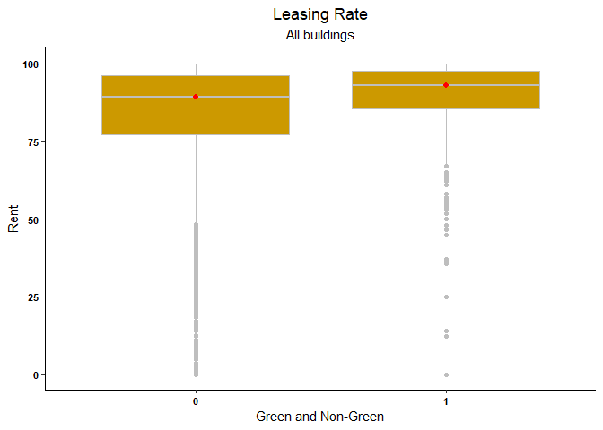

    ## [1] "Median leasing rate of green buildings :  92.92"

    ## [1] "Median leasing rate of non green buildings :  89.17"

-   Green buildings have a higher occupancy rate when compared to
    non-green buildings  
-   As the stats guru, pointed out the median of green buildings($27.6)
    is higher than the median of non-green buildings($25). But he did
    not consider the effect of confouding variables while performing the
    analysis. In teh next section, we will check or the influence of
    confounding vairables on the Rent of green and non-green buildings

2.We will create some hypotheses using which we will steer through the
data to understand if the data agrees with the respective hypotheses  
a.Less leasing\_rate might be a proxy for less demand for commercial
real-estate  
b.Rent decreases with age for buildings  
c.Renovated buildings with age &gt;30 years get higher rent than
buidings with age &lt; 30 without renovation  
d.Buidings with amenities have higher rents than the other buildings
e.class\_a buildings have higher rent than the other buildings

Let's plot the respective distribution to find if the hypotheses can be
supported using the relationships

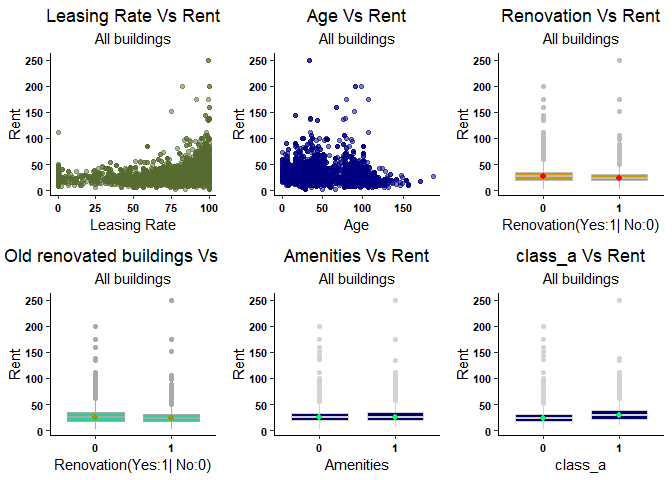

**Findings**:  
\* Age has no visible relation with Rent when all buildings are
considered  
\* Buildings with Amenities and class\_a quality material have slightly
higher rent than the other buildings

#### Step 2: Comparison of different variables for Green and Non-Green buildings

Lets check the above hypotheses for Green and Non-Green buildings
separtely to see if there is any influence

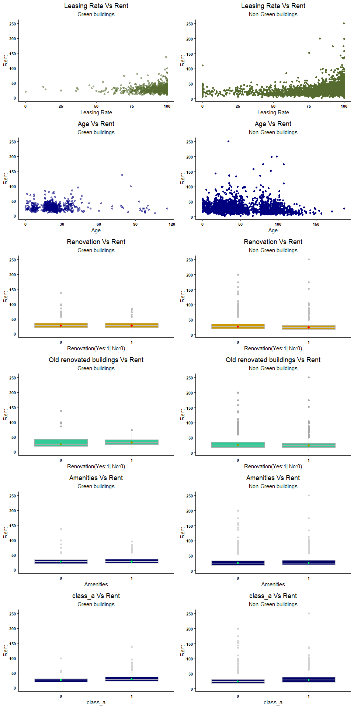
**Findings**:  
\* Older Green Buildings have the possibility of charging higher rents
when they are renovated  
\* There are no variables that affect the distribution of rent even
after the buildings are split into green and non-green buildings

#### Step 3: Deep Diving into some of the potential variables to see the difference between rents between green and non-green buildings

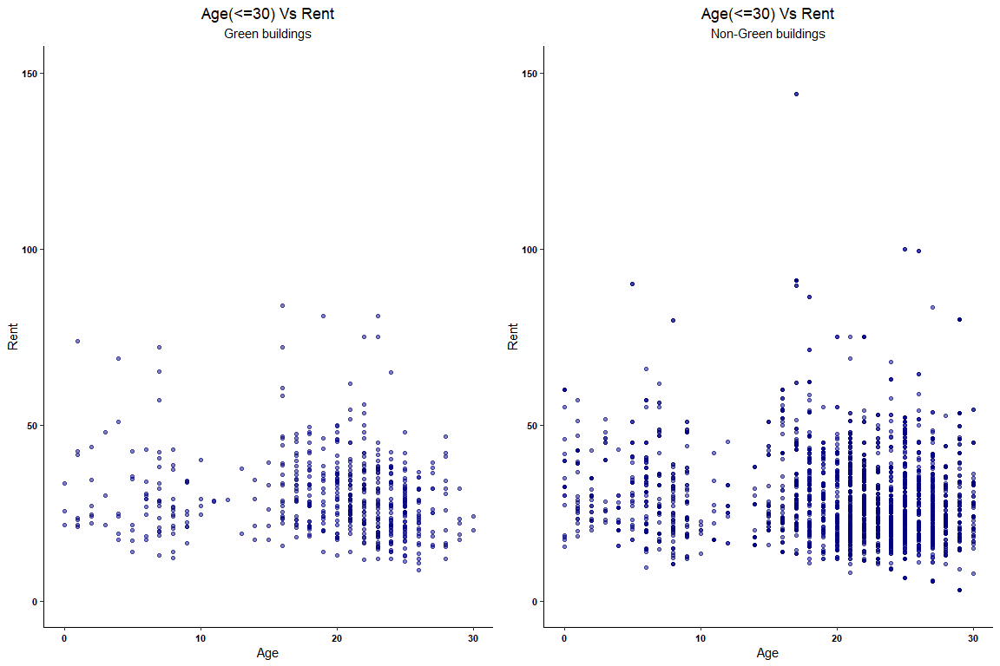

    ## [1] "Median rent of green buildings less than 30 years of age: 28"

    ## [1] "Median rent of non - green buildings less than 30 years of age: 27"

**Findings:**  
\* Age of the building does not affect the rent of the buildings as the
green buildings have consistently higher rents across ages

#### After exploring multiple variables, it is clear that there is no one variable that affects the rent and clearly people are willing to pay more rent based on the green perception of the building although there is no way to quantify that experience

#### Step 4: As it is evident that people are willing to pay more for the green buildings,lets come up with an estimate for the returns on building a green building

1.Lets consider a local market(cluster) to check the probability of
receiving a particular amount of rent  
\* Let us check the distribution of cluster rents to understand the
local markets  
\* You can observe that more than 50% of the markets have rent less than
$25 rent  
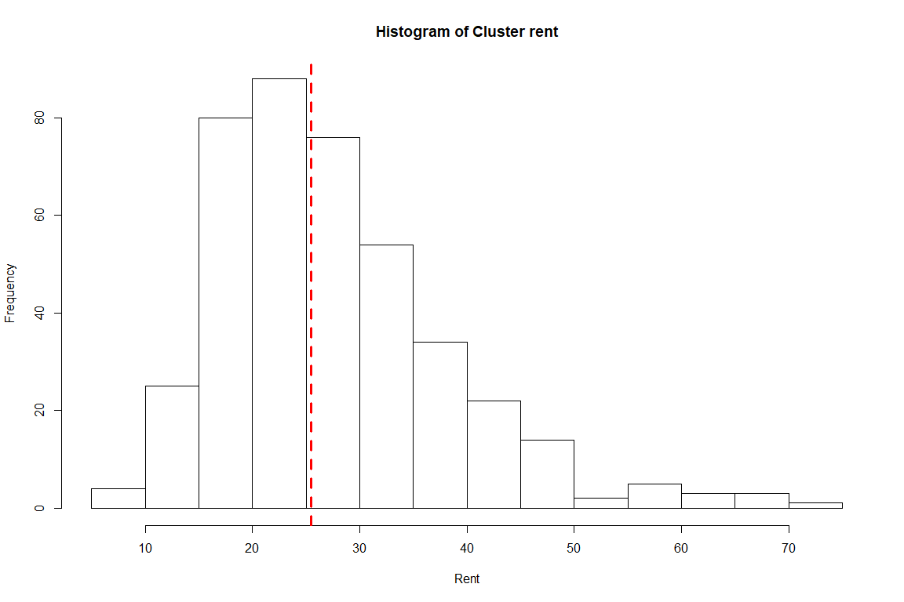
**We can further calculate the number of local markets in which the rent
for green building is higher than the median cluster rent as median is
more robust to outliers**

-   Green buildings have higher rents than the median rents in more than
    75% of the local markets and on an averge it is $4.89  
-   In about 25% of the local markets, green buildings have lesser rent
    than the median rents and the value is $3 on an average  
-   With these observations,we can conclude that there is more than 75%
    chance that you will earn higher rents than the average in the local
    markets with a value more than $4.89

2.Estimate for calculating the returns on building a green building  
\* If we consider the mean of the differences between green buildings
and the median local market rents, we see that green buildings get ~$3
more than the non-green builings

**Adjusting the estimates of the stats guru, by 0.4 , we can see that an
extra $750,000 revenue can be earned by building a green building.**  
**Based on the extra revenue, we can recuperate the costs in 6.66 years
and even with 90% occupancy as is evident from data, the builder can
start earning profits after 7.4 years**

### Bootstrapping

Value at risk for Even split portfolio, Safe portfolio and aggressive
portfolio have been calculated below

    ## [1] "SPY" "TLT" "LQD" "EEM" "VNQ"

    ##      Index              ClCl.SPYa         
    ##  Min.   :2004-09-29   Min.   :-0.0984477  
    ##  1st Qu.:2008-03-18   1st Qu.:-0.0037466  
    ##  Median :2011-08-31   Median : 0.0007051  
    ##  Mean   :2011-09-03   Mean   : 0.0004168  
    ##  3rd Qu.:2015-02-22   3rd Qu.: 0.0053901  
    ##  Max.   :2018-08-08   Max.   : 0.1451977  
    ##                       NA's   :1

    ##      Index              ClCl.TLTa         
    ##  Min.   :2004-09-29   Min.   :-0.0504495  
    ##  1st Qu.:2008-03-18   1st Qu.:-0.0047801  
    ##  Median :2011-08-31   Median : 0.0004928  
    ##  Mean   :2011-09-03   Mean   : 0.0002613  
    ##  3rd Qu.:2015-02-22   3rd Qu.: 0.0053158  
    ##  Max.   :2018-08-08   Max.   : 0.0516616  
    ##                       NA's   :1

    ##      Index              ClCl.LQDa         
    ##  Min.   :2004-09-29   Min.   :-0.0911111  
    ##  1st Qu.:2008-03-18   1st Qu.:-0.0018986  
    ##  Median :2011-08-31   Median : 0.0003557  
    ##  Mean   :2011-09-03   Mean   : 0.0001911  
    ##  3rd Qu.:2015-02-22   3rd Qu.: 0.0023470  
    ##  Max.   :2018-08-08   Max.   : 0.0976772  
    ##                       NA's   :1

    ##      Index              ClCl.EEMa        
    ##  Min.   :2004-09-29   Min.   :-0.161662  
    ##  1st Qu.:2008-03-18   1st Qu.:-0.008273  
    ##  Median :2011-08-31   Median : 0.000957  
    ##  Mean   :2011-09-03   Mean   : 0.001687  
    ##  3rd Qu.:2015-02-22   3rd Qu.: 0.009474  
    ##  Max.   :2018-08-08   Max.   : 2.015729  
    ##                       NA's   :1

    ##      Index              ClCl.VNQa        
    ##  Min.   :2004-09-29   Min.   :-0.195137  
    ##  1st Qu.:2008-03-18   1st Qu.:-0.006559  
    ##  Median :2011-08-31   Median : 0.000788  
    ##  Mean   :2011-09-03   Mean   : 0.000512  
    ##  3rd Qu.:2015-02-22   3rd Qu.: 0.007673  
    ##  Max.   :2018-08-08   Max.   : 0.170065  
    ##                       NA's   :1

#### Based on the summary statistics of the stocks, we can infer that SPY,TLT,LQD are in the safe category as their returns are in a resaonable range.

#### TLT with +-5%,LQD with +-9% and SPY with +14% and -9%

#### Split considered for Safe portfolio is SPY:30%,TLT :35%,LQD : 35%

#### VNQ and EEM are high risk/return stocks as the return varies over a wide range

#### Range of VNQ stock : -19.5% to +17%

#### Range of EEM stock : -16.16% to +201%

#### Split considered for Safe portfolio is VNQ:50%,EEM :50%

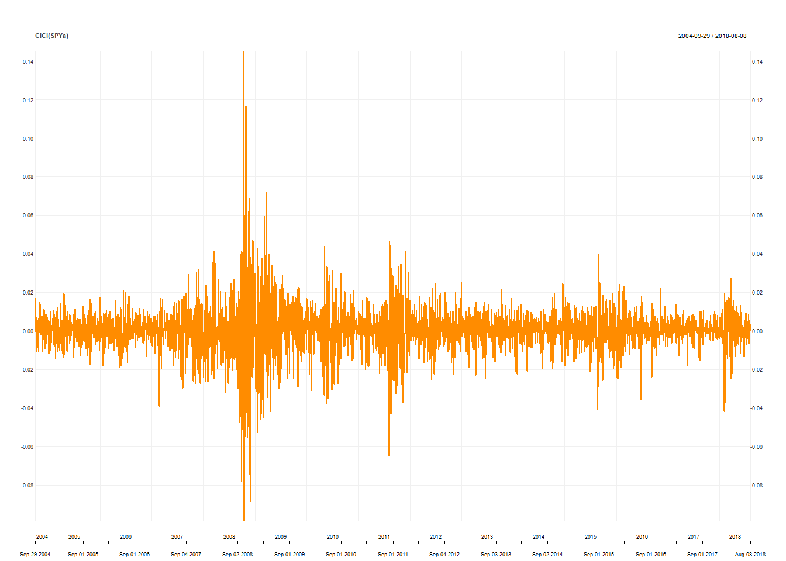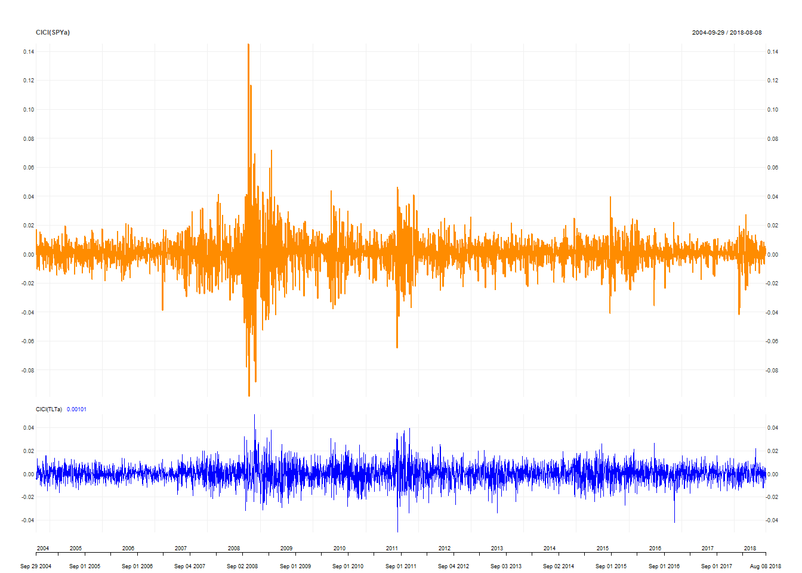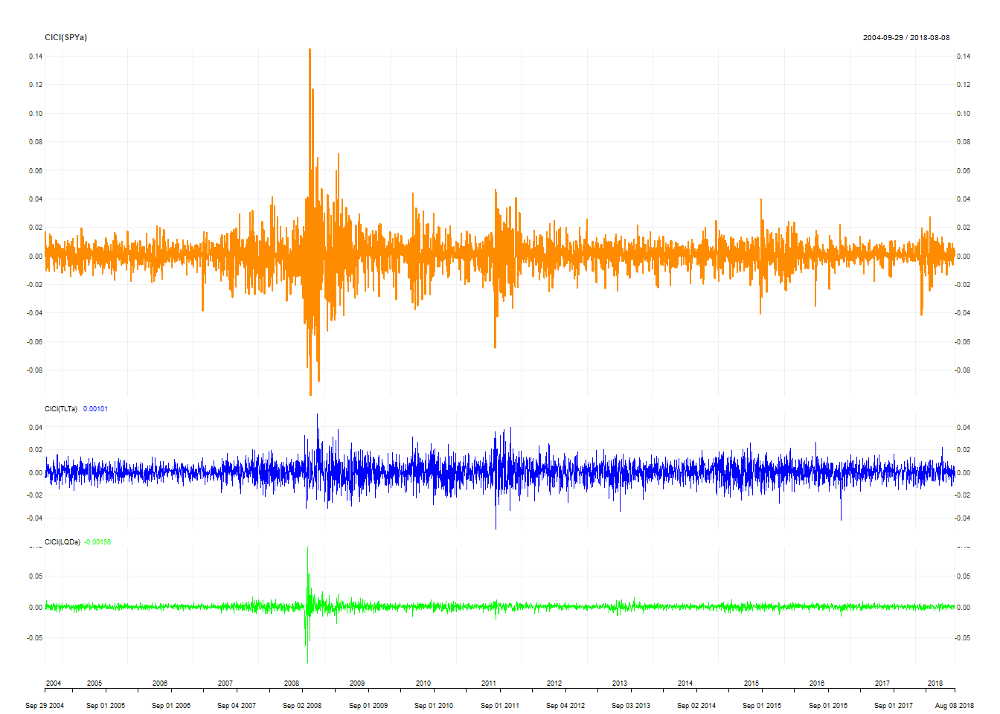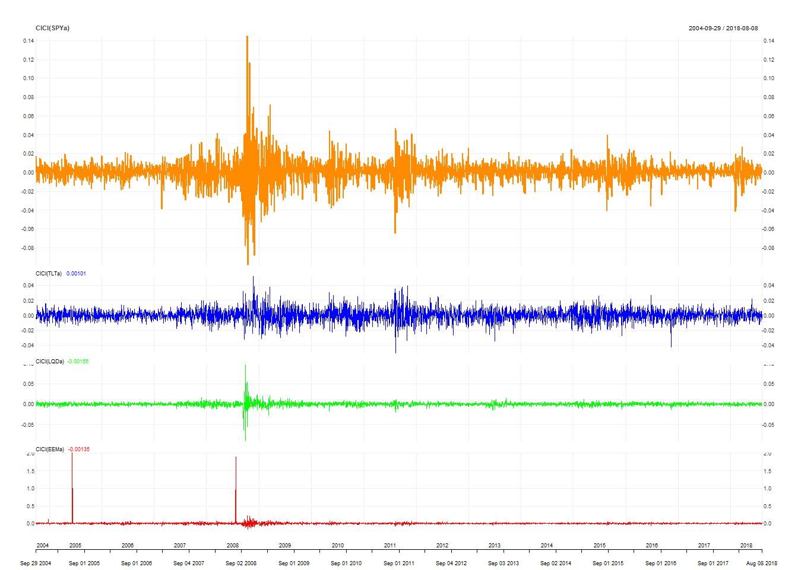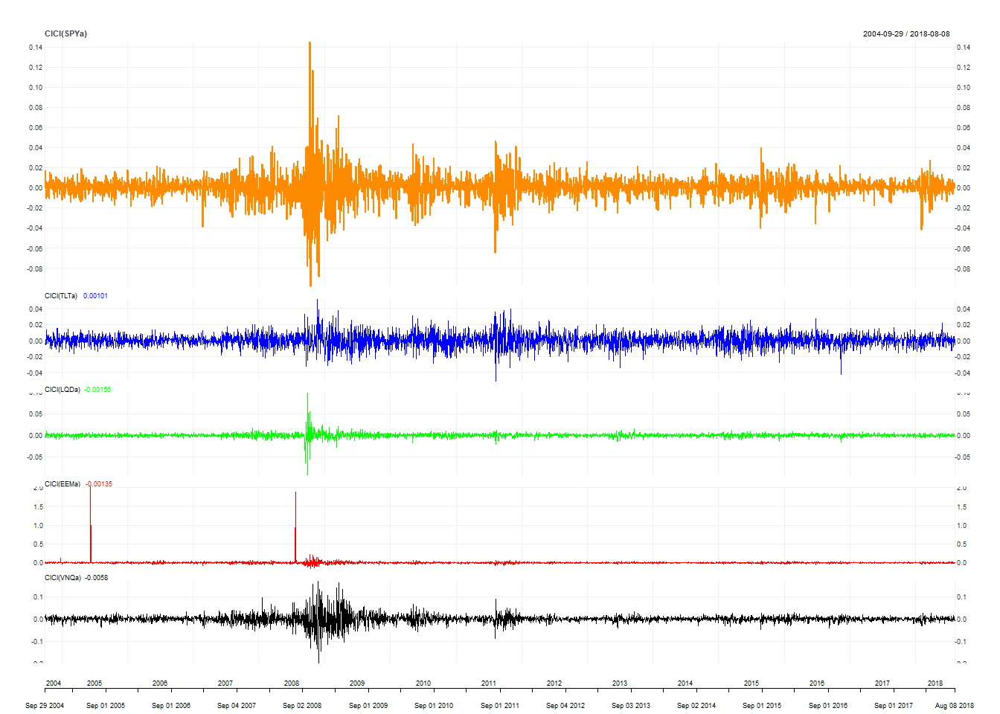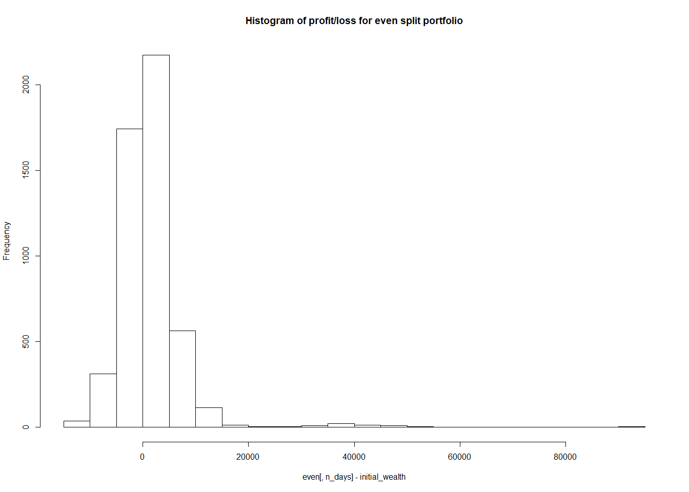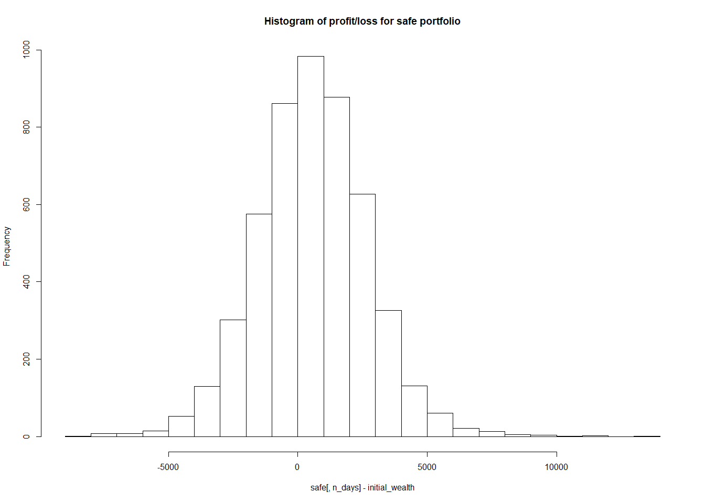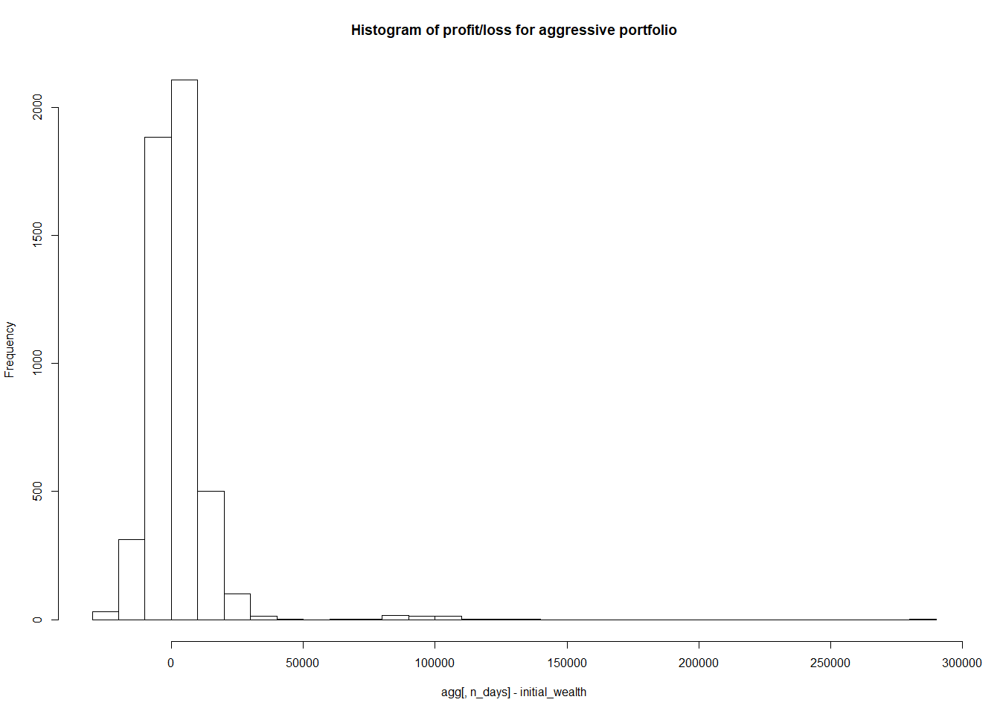

    ## [1] "Value at risk for even split :  5729.5"

    ## [1] "Value at risk for safe portfolio :  2771.23"

    ## [1] "Value at risk for aggressive portfolio :  11617.59"

#### Based on the clients recommendation and risk appetite, we can further reallocate the assets among the stocks

### Market Segmentation

Objective : To create market segments based on the user interests and
identify the profiles of those segments  
Step 1: Explore the data for correlated interests  
Step 2: Normalize the data and perform clustering  
Step 3: Profile the clusters after k-means clustering

Step1:

    ## 'data.frame':    7882 obs. of  37 variables:
    ##  $ X               : Factor w/ 7882 levels "123pxkyqj","12grikctu",..: 3720 2540 4096 596 3197 3609 4749 6518 7418 4917 ...
    ##  $ chatter         : int  2 3 6 1 5 6 1 5 6 5 ...
    ##  $ current_events  : int  0 3 3 5 2 4 2 3 2 2 ...
    ##  $ travel          : int  2 2 4 2 0 2 7 3 0 4 ...
    ##  $ photo_sharing   : int  2 1 3 2 6 7 1 6 1 4 ...
    ##  $ uncategorized   : int  2 1 1 0 1 0 0 1 0 0 ...
    ##  $ tv_film         : int  1 1 5 1 0 1 1 1 0 5 ...
    ##  $ sports_fandom   : int  1 4 0 0 0 1 1 1 0 9 ...
    ##  $ politics        : int  0 1 2 1 2 0 11 0 0 1 ...
    ##  $ food            : int  4 2 1 0 0 2 1 0 2 5 ...
    ##  $ family          : int  1 2 1 1 1 1 0 0 2 4 ...
    ##  $ home_and_garden : int  2 1 1 0 0 1 0 0 1 0 ...
    ##  $ music           : int  0 0 1 0 0 1 0 2 1 1 ...
    ##  $ news            : int  0 0 1 0 0 0 1 0 0 0 ...
    ##  $ online_gaming   : int  0 0 0 0 3 0 0 1 2 1 ...
    ##  $ shopping        : int  1 0 2 0 2 5 1 3 0 0 ...
    ##  $ health_nutrition: int  17 0 0 0 0 0 1 1 22 7 ...
    ##  $ college_uni     : int  0 0 0 1 4 0 1 0 1 4 ...
    ##  $ sports_playing  : int  2 1 0 0 0 0 1 0 0 1 ...
    ##  $ cooking         : int  5 0 2 0 1 0 1 10 5 4 ...
    ##  $ eco             : int  1 0 1 0 0 0 0 0 2 1 ...
    ##  $ computers       : int  1 0 0 0 1 1 1 1 1 2 ...
    ##  $ business        : int  0 1 0 1 0 1 3 0 1 0 ...
    ##  $ outdoors        : int  2 0 0 0 1 0 1 0 3 0 ...
    ##  $ crafts          : int  1 2 2 3 0 0 0 1 0 0 ...
    ##  $ automotive      : int  0 0 0 0 0 1 0 1 0 4 ...
    ##  $ art             : int  0 0 8 2 0 0 1 0 1 0 ...
    ##  $ religion        : int  1 0 0 0 0 0 1 0 0 13 ...
    ##  $ beauty          : int  0 0 1 1 0 0 0 5 5 1 ...
    ##  $ parenting       : int  1 0 0 0 0 0 0 1 0 3 ...
    ##  $ dating          : int  1 1 1 0 0 0 0 0 0 0 ...
    ##  $ school          : int  0 4 0 0 0 0 0 0 1 3 ...
    ##  $ personal_fitness: int  11 0 0 0 0 0 0 0 12 2 ...
    ##  $ fashion         : int  0 0 1 0 0 0 0 4 3 1 ...
    ##  $ small_business  : int  0 0 0 0 1 0 0 0 1 0 ...
    ##  $ spam            : int  0 0 0 0 0 0 0 0 0 0 ...
    ##  $ adult           : int  0 0 0 0 0 0 0 0 0 0 ...

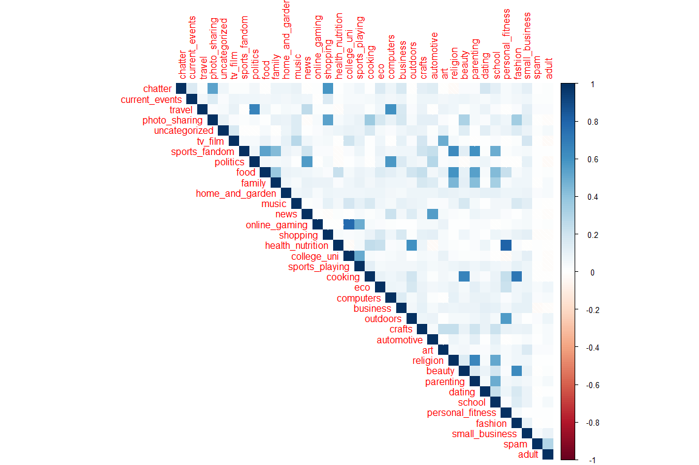
**Findings:**  
\* Shopping and photo-sharing are positively correlated  
\* College\_uni and online\_gaming stands out with a strong positive
correlation  
\* Health\_nutrition,peronal\_fitness and outdoors have a high positive
correlation showing these people are health conscious  
\* Fashion and beauty have a strong postive correlation

We can include all the variables in the cluster analysis to understand
if the same points appear after profiling the clusters

Step 2: Normalize the data and perform k - means clustering

There is no considerable decrease in the error after 8 clusters.  
Hence 8 clusters were considered to be optimal for the analysis  
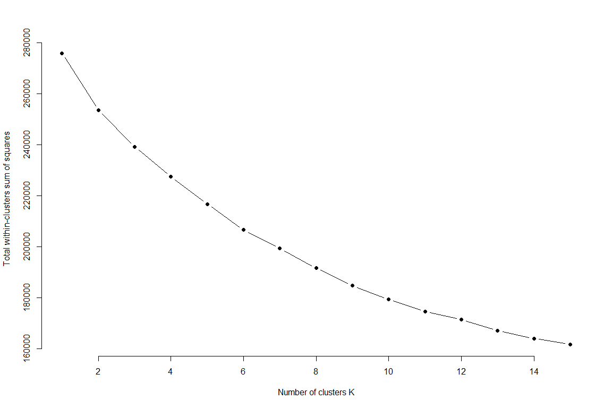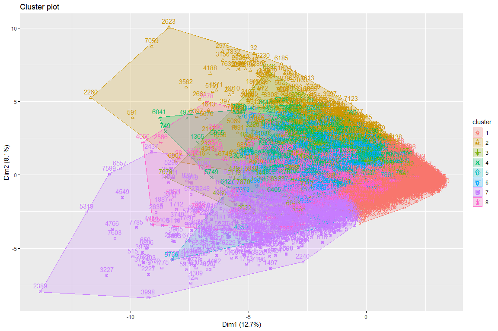
**The cluster separation is not very clear from the plot. So lets
analyze the cluster centers to come up with the profiles based on the
clusters**

image:

**Findings:**  
\* There are multiple interesting profiles that came out of the clusters

Cluster 2: People who are grouped under cluster 2 tweet a lot about
photo sharing,cooking,beauty and fashion

Cluster 3: This segment is profoundly university students as they tweet
about sports,universities and online games

Cluster 4: This segment of people are potentially health conscious
people as they tweet mostly about health,nutrition,outdoors and personal
fitness

Cluster 5: Most of the tweets that these people tweet are adult related
tweets

Cluster 6: This segment of people are interested in tweeting about
films, art, music, tv and dating

Cluster 7: This segment of people might be profoundly adults as they
tweet a lot about religion, parenting, family, sports, school,food and
crafts

Cluster 8: People from this segment are interested in tweeting about
travel, politics, news and automotive

End
---
