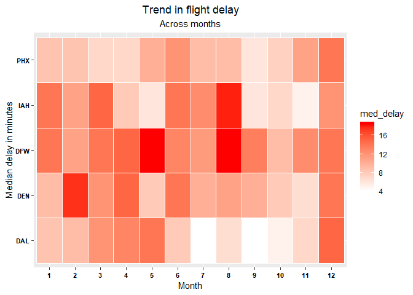

### Flights at ABIA

#### Objective of this analysis is to identify the general trends in the flight delay times and suggest the right time/month to the passenger depending on the destination that he/she wants to fly to

1.We will first assess the flight volumes across months and time of the
day  
2.Identify the general delay trends during those time frames  
3.Identify the top destinations by volume of flights  
4.Identify the flight volumes to those destinations  
5.Recommend the month and time of the day to travel to these
destinations based on the historical median delays of those flights

#### 1. Overall trend

Understanding the magnitude of flights that are coming into Austin will
help us in assessing the traffic of Austin airport during different
seasons.  
In addition to that,percentage of fligths that are delayed during those
months would give us an insight into the operating logistics of Austin
airport

-   Number of flights from Austin tend to decline towards the end of the
    year  
-   This might be due to the onset of the holiday season in the last
    quarter

#### 2.Distribution of flights that got delayed each month

-   Delays in departure are relatively less during the Sep,Oct,Nov  
-   March,June and December encounter delays for maximum number of
    flights

#### 3. Time of the day

Let's look at the analysis with the location  
\* Top destinations from Austin Time of the day has been grouped into
different types for the convenience of analysis  
Number of flights from Austin decrease towards the end of the year by
about 25%

It is important to continue further to look at the pattern during hour
of the day, to understand the average traffic during a particular time
of the day  

-   We can observe maximum number of flights during Morning(6 A.M to 9
    A.M) and Evening(between 3 P.M to 6 P.M)  
-   Also there is a steady decline towards the end of the day

#### Distribution of delays for the scheduled flights during the respective times

-   Number of flight delays increase towards the end of the day

#### 4. Identifying the top destinations by flight volume and their flight volumes across months

-   Although, DAL started with a higher volume at the start of the year,
    there was a sudden dip during July  
-   Apart from that, all other destinations have a steady trend across
    months  
-   There is small bump during october in flights for all destinations

#### 5.Identification of month and time of the day with maximum delays for the top 5 destinations

##### Month

Lets see the median delay that we can expect if we are planning to fly
to those destinations during different hours of the day

-   Based on the heat map,we can infer that flight to Denver in Feb and
    to DFW and IAH in August face a median delay of 16 mins which is the
    highest among the top 5 destinations  
-   In addition to that, flights to Dallas are almost prompt during July
    to October

##### Time of the day

**Recommendations:**

-   We can observe that ther are no early morning flights to DAL and DEN
    and no Late night flights to any destination except DAL  
-   If you are travelling to Pheonix, we can except maximum delays at
    Early morning and night  
-   While travelling to Denver,it will be good if we avoid flights
    during pre-afternoon and evening as they tend to get delayed  
-   Morning is the best time to go to Dallas

### Author attribution

**Objective: To attribute the article in a document to the respective
author using classification models and text analytics**

Let us consider a step by step model to create a classifiation model
from the text data to identify the author of the article

1.Read the data in suitable formats required for the exercise  
2.Perform all the pre-processing tasks on the dataset extracted like
removing stop words, changing to lower case e.t.c  
3.Create the TF-IDF matrix for both train and test data  
4.Dimensionality reduction  
5.Use the TF-IDF data to create models and compare the accuracy across
models to identify the author of a particular article

**1.Read the data in suitable formats**  
As the data is a text file, we will have to convert into a format that
is acceptable for performing the pre-processing functions.After
importing the files, a corpus has been created with all the documents
separately for train and test documents

    library(tm)
    library(proxy)
    library(randomForest)
    library(kknn)
    library(dplyr)
    library(caret)

    # read in train data and create DTM
    author_names_train <- dir("./ReutersC50/C50train")

    file_list_train <- NULL
    class_labels_train <- NULL

    for (name in author_names_train){
      file_list_train <- c(file_list_train, Sys.glob(paste0('./ReutersC50/C50train/', name,'/*.txt')))
      class_labels_train <- c(class_labels_train, rep(name, each = length(Sys.glob(paste0('./ReutersC50/C50train/', name,'/*.txt')))))
    }

    # define the function that will read in the files
    readerPlain = function(fname){
      readPlain(elem = list(content = readLines(fname)), 
                id = fname, language = 'en') }

    # read in the files and store them as a list
    all_files_train <- lapply(file_list_train, readerPlain)

    # give each file a representative name

    file_names_train <- file_list_train %>%
      strsplit("/") %>%
      lapply(tail,n = 2) %>%
      lapply(paste0, collapse = "") %>%
      unlist

    # create a dataframe with doc_id as author-article and text as the text in that article
    text_vector_train <- NULL

    for(i in 1:length(file_names_train)){
      text_vector_train <- c(text_vector_train, paste0(content(all_files_train[[i]]), collapse = " "))
    }

    # dataframe with text and document_id
    text_df_train <- data.frame(doc_id = file_names_train,
                                text = text_vector_train)

    # convert the dataframe to a Corpus
    train_corpus_raw <- VCorpus(DataframeSource(text_df_train))

    # read in the test documents
    author_names_test <- dir("./ReutersC50/C50test")

    file_list_test <- NULL
    class_labels_test <- NULL

    for (name in author_names_test){
      file_list_test <- c(file_list_test, Sys.glob(paste0('./ReutersC50/C50test/', name,'/*.txt')))
      class_labels_test <- c(class_labels_test, rep(name, each = length(Sys.glob(paste0('./ReutersC50/C50test/', name,'/*.txt')))))
    }

    # read in the files and store them as a list
    all_files_test <- lapply(file_list_test, readerPlain)

    # give each file a representative name

    file_names_test <- file_list_test %>%
      strsplit("/") %>%
      lapply(tail,n = 2) %>%
      lapply(paste0, collapse = "") %>%
      unlist

    # create a dataframe with doc_id as author-article and text as the text in that article
    text_vector_test <- NULL

    for(i in 1:length(file_names_test)){
      text_vector_test <- c(text_vector_test, paste0(content(all_files_test[[i]]), collapse = " "))
    }

    # dataframe with text and document_id
    text_df_test <- data.frame(doc_id = file_names_test,
                               text = text_vector_test)

    # convert the dataframe to a Corpus
    test_corpus_raw <- VCorpus(DataframeSource(text_df_test))

**2.Pre-Processing both train and test data**

While dealing with text data, it is optimal to ignore
numbers,punctuations,white spaces as they don't help much in gaining an
insight into the patterns present in the text.It is also important to
ignore the **Stop words**(words like is/an/the e.t.c) as they occur
multiple times with no real information being added to the models.In
this step, we have removed the stop words, punctuations, numbers to
proceed with the analysis

    #train data
    # pre-processing to remove punctuations, spaces, etc.
    train_corpus_preproc <- train_corpus_raw
    train_corpus_preproc <- tm_map(train_corpus_preproc, content_transformer(tolower))
    train_corpus_preproc <- tm_map(train_corpus_preproc, content_transformer(removeNumbers)) # remove numbers
    train_corpus_preproc <- tm_map(train_corpus_preproc, content_transformer(removePunctuation)) # remove punctuation
    train_corpus_preproc <- tm_map(train_corpus_preproc, content_transformer(stripWhitespace)) ## remove excess white-space
    train_corpus_preproc <- tm_map(train_corpus_preproc, content_transformer(removeWords), stopwords("en")) # remove stop words

    #test data

    # pre-processing to remove punctuations, spaces, etc.
    test_corpus_preproc <- test_corpus_raw
    test_corpus_preproc <- tm_map(test_corpus_preproc, content_transformer(tolower)) # make everything lowercase
    test_corpus_preproc <- tm_map(test_corpus_preproc, content_transformer(removeNumbers)) # remove numbers
    test_corpus_preproc <- tm_map(test_corpus_preproc, content_transformer(removePunctuation)) # remove punctuation
    test_corpus_preproc <- tm_map(test_corpus_preproc, content_transformer(stripWhitespace)) ## remove excess white-space
    test_corpus_preproc <- tm_map(test_corpus_preproc, content_transformer(removeWords), stopwords("en")) # remove stop words

**3.Create TF-IDF matrix for both train and test data**

Next step in this process is to create a TF-IDF matrix of the corpus of
documents that we have created. TF-IDF is a combination of TF(Term
frequency) and IDF(Inverse document frequency). TF gives the number of
times a word occurs in a document while IDF gives less weightage to
words that occur in multiple documents and is not useful in identifying
the style of anyone single author.

After the creation of the TF-IDF matrix, sparsing is one more step that
is recommended while dealing with text data. **In sparsing, we remove
terms that occur less frequently among all the documents**.This is
generally decided by a threshold that is set heuristically based on the
TF-IDF matrix. In this analysis, the threshold is set at **99%(words
that are not present in 99% of the documents will be removed from the
analysis)**

    #train
    # convert the corpus to a document term matrix
    DTM_train <- DocumentTermMatrix(train_corpus_preproc)

    # remove sparse terms from the DTM_train
    DTM_train <- removeSparseTerms(DTM_train, 0.99)

    #test
    # convert the corpus to a document term matrix
    DTM_test <- DocumentTermMatrix(test_corpus_preproc, 
                                   control = list(dictionary = Terms(DTM_train)))

    # calculate the TF-IDF for each term in the DTM
    tfidf_train <- weightTfIdf(DTM_train)
    tfidf_test <- weightTfIdf(DTM_test)

    X_train <- as.matrix(tfidf_train)
    X_test <- as.matrix(tfidf_test)

**4.Dimensionality reduction**

Often while dealing with text data, we encounter with dimensionality
problem. Due to the sheer volume of words present in any language, we
often end up with thousands of words(columns) in the TF-IDF matrix. This
makes it comptutationally heavy for any system to perform any modelling
on the data. Dimensionality is the go to solution in these situations.  
For this problem, i have used **PCA(Prinipal Component Analysis)** to
reduce the number of dimensions in the data set.  
After running PCA, a total of 350 components have been selected for
further analysis as they explain about 50% of the total variaion in the
data.

There is one interseting step that we perform during PCA. As we have 2
different datasets(train and test) to deal with, it is important to
ensure that both the datasets have similar type of principal components
that are aligned towards the same subspace respectively.

**To achieve that, we will use the loadings, rotations and other
attributes from the PC object of the train data to align the components
of the test data in a similar orientation as the train data.**

    pca_train = prcomp(X_train, scale=TRUE)
    # plot(pca_train)

    # we will take the first 350 components because they explain 50% of the variance in the data
    # summary(pca_train)$importance[3,]

    X_train <- pca_train$x[,1:350]
    X_train <- cbind(X_train, class_labels_train)
    loading_train <- pca_train$rotation[,1:350]

    # multiply to get a test matrix with the principal component values
    X_test_pc <- scale(X_test) %*% loading_train
    X_test_pc <- as.data.frame(X_test_pc)

    rm(list = c("all_files_test", "all_files_train", "test_corpus_preproc", "train_corpus_preproc", "text_df_test", "text_df_train",
                "author_names_test", "author_names_train", "file_list_test", "file_list_train", "i", "name", "text_vector_test",
                "text_vector_train", "file_names_test", "file_names_train", "DTM_test", "DTM_train", "pca_train",
                "test_corpus_raw", "train_corpus_raw", "tfidf_train", "tfidf_test"))

    X_train <- as.data.frame(X_train)

    for (name in names(X_train)){
      if (name == "class_labels_train"){
        next
      }else{
        X_train[[name]] <- as.numeric(as.character(X_train[[name]]))
      }
    }

    X_train$class_labels_train <- as.factor(X_train$class_labels_train)
    # 
    # plot(summary(pca_train)$importance[3,], main = "PCA Analysis Train", xlab = "Components",
    #      ylab = "Cumulative % Variance Explained")

**5. Models using features from PCA and identifying the authors**

**Attribution Model 1: knn**

It makes sense that documents closer to each other (using similar terms)
in terms of the Manhattan distance would be from the same author. Lets
try K-Nearest Neighbors to predict the author for each document in the
test set!

1.We will use a K Nearest neighbor model and look for the best K-value
in the set {5,7,9,11}.  
2.For the distance metric, we will use the Manhattan distance!

    # knn model - 29% max accuracy at k = 9
    library(kknn)

    # a vector to store the accuracies of the knn model
    accuracies <- NULL

    # try knn with 5,7,9 and 11 nearest neighbors
    for (i in c(5,7,9,11)){
      knn_model <- kknn(class_labels_train ~ .,
                        X_train,
                        X_test_pc,
                        distance = 1,
                        k= i,
                        kernel = 'rectangular')
      
      accuracies <- c(accuracies,sum(knn_model$fitted.values == class_labels_test)/length(class_labels_test))
    }

    plot(c(5,7,9,11), accuracies, main = "KNN accuracy vs K", xlab = "K-Values", ylab = "Accuracy Score", lty = 1)

With Knn, we get an overall accuracy of ~35%. Let's see how the model
worked for different authors

Following are the top authors that the model gets right!

    ## # A tibble: 5 x 2
    ##   Actual_Author   Accuracy
    ##   <fct>              <dbl>
    ## 1 TheresePoletti      0.94
    ## 2 LynneO'Donnell      0.84
    ## 3 JoWinterbottom      0.8 
    ## 4 LynnleyBrowning     0.8 
    ## 5 JimGilchrist        0.72

Following are the authors that the model performs very badly

    ## # A tibble: 5 x 2
    ##   Actual_Author  Accuracy
    ##   <fct>             <dbl>
    ## 1 AlexanderSmith     0.02
    ## 2 JaneMacartney      0.02
    ## 3 MichaelConnor      0.02
    ## 4 KarlPenhaul        0.04
    ## 5 EdnaFernandes      0.06

**Attribution model 2: Random Forest**  
Let's run a random forest to check the accuracy of the predictions for
author attribution

    # Random Forest
    rf_model <- randomForest(class_labels_train ~ .,
                             data = X_train,
                             ntree = 1000)
    author_predict <- predict(rf_model, X_test_pc, type = "response")
    answer <- as.data.frame(table(author_predict, class_labels_test))
    answer$correct <- ifelse(answer$author_predict==answer$class_labels_test, 1, 0)

    answer_rf = answer %>% group_by(correct) %>% summarise("Correct" = sum(Freq))

    rf_accuracy <- sum(answer$Freq[answer$correct==1])*100/sum(answer$Freq)
      
    print(paste0("Accuracy is ", rf_accuracy))

    ## [1] "Accuracy is 58.92"

-   Accuracy of Random Forest is 58.92 which is better than knn

Lets see what authors have been attributed with higher accuracy

    ## # A tibble: 5 x 2
    ##   Actual_Author   Accuracy
    ##   <fct>              <dbl>
    ## 1 JimGilchrist        1   
    ## 2 LynnleyBrowning     1   
    ## 3 KarlPenhaul         0.94
    ## 4 RobinSidel          0.88
    ## 5 SimonCowell         0.86

-   Authors that the model predicted with minimum accuracy

<!-- -->

    ## # A tibble: 5 x 2
    ##   Actual_Author    Accuracy
    ##   <fct>               <dbl>
    ## 1 ScottHillis          0.12
    ## 2 TanEeLyn             0.12
    ## 3 DarrenSchuettler     0.14
    ## 4 EdnaFernandes        0.14
    ## 5 BenjaminKangLim      0.18

**Attribution model 3:** **XGBoost**

    # XGBoost model
    library(xgboost)
    train_data_xgboost_matrix <- data.matrix(X_train[,1:350])
    test_data_xgboost_matrix <- data.matrix(X_test_pc)
    class_labels_train = data.matrix(class_labels_train)

    dtrain <- xgb.DMatrix(data = train_data_xgboost_matrix, label = as.numeric(X_train[,351])-1,
                          missing = NA)
    dtest <- xgb.DMatrix(data = test_data_xgboost_matrix, label = as.numeric(as.factor(class_labels_test)) - 1)

    boost_model <- xgboost(data = dtrain,
                           nround = 30, # max number of boosting iterations
                           # distribution = "multinomial",
                           objective = "multi:softmax",
                           eta = 0.1,
                           num_class = 50,
                           max_depth = 3
                           )

    ## [1]  train-merror:0.370400 
    ## [2]  train-merror:0.271200 
    ## [3]  train-merror:0.214800 
    ## [4]  train-merror:0.192800 
    ## [5]  train-merror:0.167200 
    ## [6]  train-merror:0.152400 
    ## [7]  train-merror:0.133600 
    ## [8]  train-merror:0.122800 
    ## [9]  train-merror:0.109200 
    ## [10] train-merror:0.098000 
    ## [11] train-merror:0.089200 
    ## [12] train-merror:0.085600 
    ## [13] train-merror:0.077600 
    ## [14] train-merror:0.072800 
    ## [15] train-merror:0.066000 
    ## [16] train-merror:0.058400 
    ## [17] train-merror:0.050800 
    ## [18] train-merror:0.047200 
    ## [19] train-merror:0.043600 
    ## [20] train-merror:0.039200 
    ## [21] train-merror:0.036400 
    ## [22] train-merror:0.030800 
    ## [23] train-merror:0.028800 
    ## [24] train-merror:0.024800 
    ## [25] train-merror:0.020400 
    ## [26] train-merror:0.019200 
    ## [27] train-merror:0.017200 
    ## [28] train-merror:0.014800 
    ## [29] train-merror:0.012400 
    ## [30] train-merror:0.011200

    author_predict <- predict(boost_model, dtest)
    XGbacc <- mean(author_predict == (as.numeric(as.factor(class_labels_test)) - 1))*100
    print(paste0("Accuracy is :",XGbacc))

    ## [1] "Accuracy is :47.72"

We get 47.72 accuracy from XGBoost which is not better than the Random
forest model

**Conclusion:**

Text analytics is often computationally heavy especially when dealing
with thousands of documents. Dimensionality reduction is the best way to
go further with the analysis.There is also a downside to this as
removing the terms from the documents might result in reduced accuracies
as we have seen earlier. But that is trade-off that is essential while
dealing with data of this scale.  
Random forest gave us the best accuracy among all the other models with
a value of about ~60%. This can be further improved if we can do an
ensemble of the above models that are being used.

Association Rule mining
-----------------------

Association rule mining is a very interesting and important topic in
retail analytics.Being able to find the associations between various
products or services is the first step towards providing personalized
recommendations.  
Apriori is one of the famous algorithms that is generally used for
creating association rules and is also used for creating association
rules for this problem.

Steps followed to create the association rules

1.Data pre processing  
2.Running the apriori algorithm  
3.Visualization of the Output

Let's create the rules that will help in identifying the associations

    ## Apriori
    ## 
    ## Parameter specification:
    ##  confidence minval smax arem  aval originalSupport maxtime support minlen
    ##         0.4    0.1    1 none FALSE            TRUE       5   0.001      1
    ##  maxlen target   ext
    ##      10  rules FALSE
    ## 
    ## Algorithmic control:
    ##  filter tree heap memopt load sort verbose
    ##     0.1 TRUE TRUE  FALSE TRUE    2    TRUE
    ## 
    ## Absolute minimum support count: 9 
    ## 
    ## set item appearances ...[0 item(s)] done [0.00s].
    ## set transactions ...[169 item(s), 9835 transaction(s)] done [0.00s].
    ## sorting and recoding items ... [157 item(s)] done [0.00s].
    ## creating transaction tree ... done [0.00s].
    ## checking subsets of size 1 2 3 4 5 6 done [0.01s].
    ## writing ... [8955 rule(s)] done [0.00s].
    ## creating S4 object  ... done [0.00s].

    ##      lhs                        rhs                  support confidence     lift count
    ## [1]  {red/blush wine,                                                                 
    ##       liquor}                => {bottled beer}   0.001931876  0.9047619 11.23527    19
    ## [2]  {soda,                                                                           
    ##       popcorn}               => {salty snack}    0.001220132  0.6315789 16.69779    12
    ## [3]  {soda,                                                                           
    ##       Instant food products} => {hamburger meat} 0.001220132  0.6315789 18.99565    12
    ## [4]  {processed cheese,                                                               
    ##       ham}                   => {white bread}    0.001931876  0.6333333 15.04549    19
    ## [5]  {processed cheese,                                                               
    ##       domestic eggs}         => {white bread}    0.001118454  0.5238095 12.44364    11
    ## [6]  {flour,                                                                          
    ##       baking powder}         => {sugar}          0.001016777  0.5555556 16.40807    10
    ## [7]  {yogurt,                                                                         
    ##       whipped/sour cream,                                                             
    ##       hard cheese}           => {butter}         0.001016777  0.5882353 10.61522    10
    ## [8]  {yogurt,                                                                         
    ##       hamburger meat,                                                                 
    ##       whipped/sour cream}    => {butter}         0.001016777  0.6250000 11.27867    10
    ## [9]  {tropical fruit,                                                                 
    ##       yogurt,                                                                         
    ##       whole milk,                                                                     
    ##       sliced cheese}         => {butter}         0.001016777  0.5555556 10.02548    10
    ## [10] {yogurt,                                                                         
    ##       cream cheese ,                                                                  
    ##       other vegetables,                                                               
    ##       whipped/sour cream}    => {curd}           0.001016777  0.5882353 11.04064    10
    ## [11] {yogurt,                                                                         
    ##       other vegetables,                                                               
    ##       curd,                                                                           
    ##       whipped/sour cream}    => {cream cheese }  0.001016777  0.5882353 14.83409    10
    ## [12] {tropical fruit,                                                                 
    ##       yogurt,                                                                         
    ##       other vegetables,                                                               
    ##       white bread}           => {butter}         0.001016777  0.6666667 12.03058    10
    ## [13] {tropical fruit,                                                                 
    ##       whole milk,                                                                     
    ##       other vegetables,                                                               
    ##       rolls/buns,                                                                     
    ##       root vegetables}       => {beef}           0.001118454  0.5500000 10.48304    11
    ## [14] {tropical fruit,                                                                 
    ##       yogurt,                                                                         
    ##       whole milk,                                                                     
    ##       other vegetables,                                                               
    ##       domestic eggs}         => {butter}         0.001016777  0.6250000 11.27867    10

**Association rules**

1.There is a high probability for people to red/blush wine if they buy
bottled beer and liquor  
2.Buying soda and popcorn has a high association with salty snack  
3.Processed cheese and white bread has a high association with buying
ham based on the lift 4.Some rules are obvious like buying flour and
baking powder has a high association with sugar

**END**
